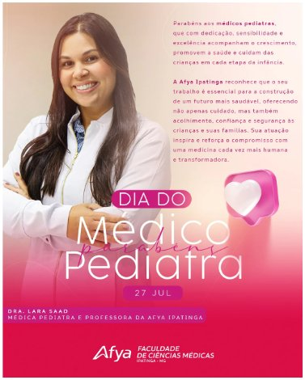
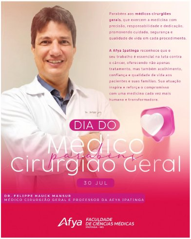

::: {.acao-figura}
{#fig-homenagem-oncologista fig-alt="Cartaz do Dia do Médico Oncologista com retrato do Dr. Luciano de Souza Viana"}
:::

## Objetivo

Celebrar o Dia do Oncologista, do Pediatra e do Cirurgião Geral, prestando homenagem aos professores dessas especialidades.

## Desenvolvimento

No mês de julho, a equipe destacou docentes que, além de compartilharem conhecimento e formarem novos profissionais, exercem suas especialidades com excelência, dedicação e compromisso com a vida.

As artes de divulgação homenagearam o Dr. Luciano de Souza Viana (Oncologia), a Dra. Lara Saad (Pediatria) e o Dr. Felippe Hauck Mansur (Cirurgia Geral).

## Resultados e encaminhamentos

Registro público de reconhecimento às especialidades homenageadas e aos docentes envolvidos.

## Evidências

{fig-alt="Cartaz do Dia do Médico Pediatra com retrato da Dra. Lara Saad"}

{fig-alt="Cartaz do Dia do Médico Cirurgião Geral com retrato do Dr. Felippe Hauck Mansur"}
