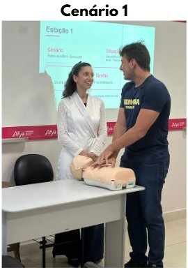
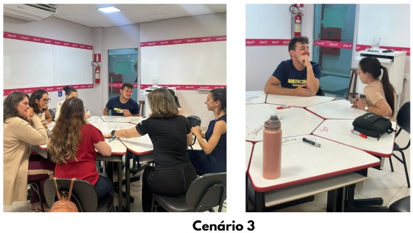
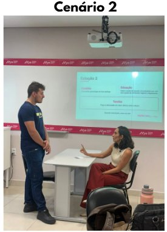

::: {.acao-figura}
{#fig-oficina-oste fig-alt="Dois facilitadores em polo NAPED apresentam slide OSTE SDD 2026.1 em sala com projetor"}
:::

## Objetivo

Desenvolver competências docentes por meio de simulação padronizada, usando a metodologia Objective Structured Teaching Encounters (OSTE) durante a Semana de Desenvolvimento Docente da Afya Ipatinga.

## Desenvolvimento

Inspirado no OSCE, o OSTE cria cenários padronizados em que professores enfrentam situações reais de ensino, interagindo com um estudante simulado. Após cada estação, os participantes recebem feedback estruturado e refletem sobre estratégias para aprimorar sua prática pedagógica.

A oficina foi conduzida pelos professores Maria Luísa Franco e Fábio Castro.

## Resultados e encaminhamentos

Reforço do compromisso da Afya Ipatinga com a inovação pedagógica e a formação contínua dos docentes, por meio de prática simulada e feedback estruturado.

## Evidências

{fig-alt="Registro de estação da oficina OSTE"}

{fig-alt="Docentes participando da oficina OSTE"}

{fig-alt="Momento de feedback na oficina OSTE"}
