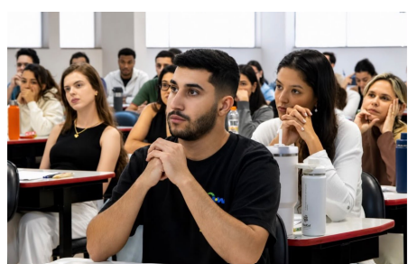
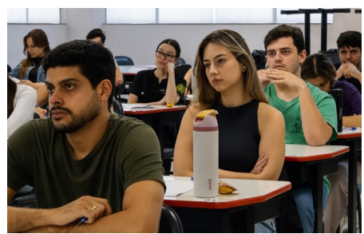
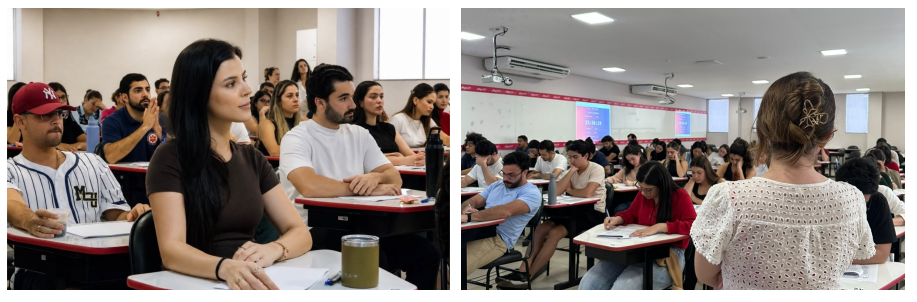
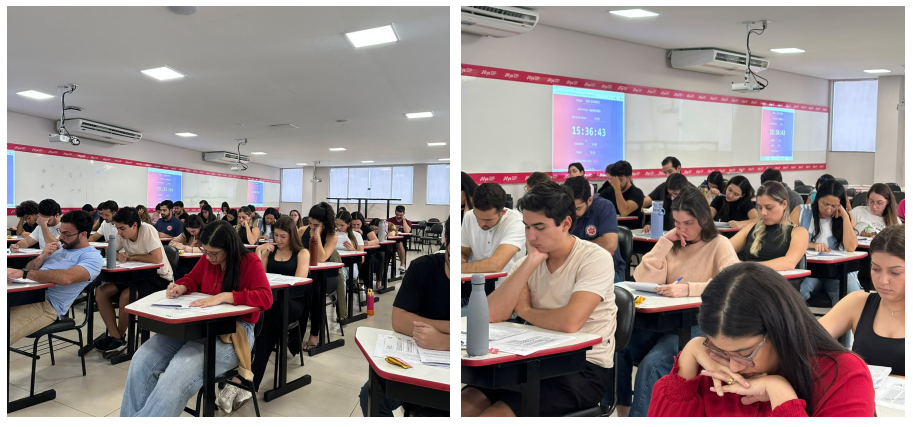

::: {.acao-figura}
{#fig-simulado-enamed-01 fig-alt="Estudantes em sala de aula durante a realização de um simulado"}
:::

## Retomada dos estudos com estratégia

Em julho de 2026, a Afya Ipatinga realizou o primeiro simulado pós-férias do programa **Trajetória ENAMED**. A atividade marcou a retomada dos estudos e ofereceu aos estudantes uma oportunidade de mobilizar conhecimentos, reconhecer avanços e identificar pontos que merecem atenção no percurso de preparação.

Mais do que testar conteúdos, o simulado compõe uma estratégia de acompanhamento da evolução acadêmica. A experiência contribui para que cada estudante observe o próprio desempenho, organize prioridades de estudo e desenvolva maior familiaridade com situações avaliativas que integram os desafios da formação médica.

Ao reunir planejamento, prática e análise dos resultados, o Trajetória ENAMED fortalece uma preparação contínua e orientada. Cada etapa é pensada para apoiar estudantes na construção de repertório, segurança e autonomia, contribuindo para a formação de profissionais cada vez mais preparados para transformar vidas.

## Evidências da atividade

::: {.acao-figura}
{#fig-simulado-enamed-02 fig-alt="Estudantes concentrados em sala durante a realização de um simulado" fig-cap="Participantes durante a realização do simulado."}
:::

::: {.acao-figura}
{#fig-simulado-enamed-03 fig-alt="Turma realizando uma avaliação em sala de aula" fig-cap="Momento de aplicação do primeiro simulado pós-férias."}
:::

::: {.acao-figura}
{#fig-simulado-enamed-04 fig-alt="Estudantes realizando um simulado em sala de aula" fig-cap="Aplicação do simulado no contexto do programa Trajetória ENAMED."}
:::
