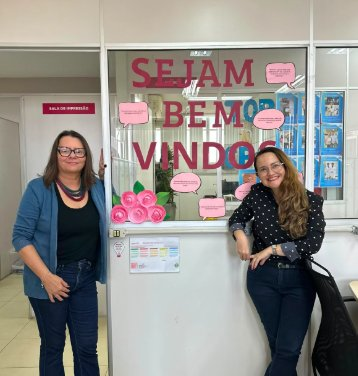

::: {.acao-figura}
{#fig-volta-aulas-2026-2 fig-alt="Card NAPED Afya com mensagem Sejam bem-vindos, docentes, para o semestre 2026.2"}
:::

## Objetivo

Receber a equipe docente no início do semestre letivo 2026.2 de forma acolhedora e personalizada.

## Desenvolvimento

Além do envio de uma mensagem de boas-vindas personalizada a cada professor, desejando um semestre repleto de conquistas, aprendizado e sucesso, a equipe organizou um painel de boas-vindas para tornar o retorno ainda mais acolhedor e especial.

## Resultados e encaminhamentos

Início do semestre 2026.2 marcado por acolhimento institucional e comunicação direta com o corpo docente.

## Evidências

{fig-alt="Registro do acolhimento de volta às aulas 2026.2"}

{fig-alt="Material de boas-vindas aos docentes"}

{fig-alt="Registro adicional do acolhimento docente 2026.2"}
