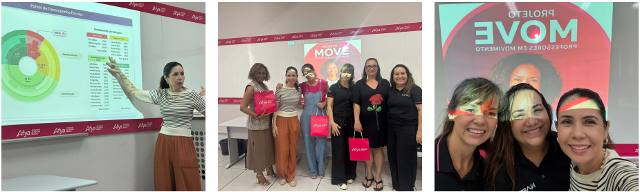
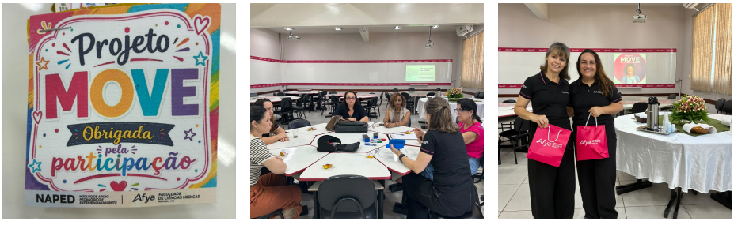
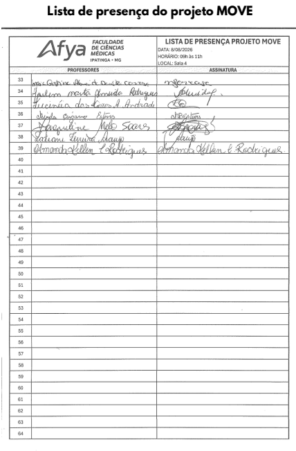

::: {.acao-figura}
{#fig-terceiro-encontro-move fig-alt="Arte do Projeto MOVE Professores em Movimento convidando para encontro em 8 de agosto, às 9 horas, na Sala 12 da Afya Ipatinga"}
:::

## Práticas compartilhadas, aprendizagens multiplicadas

O **3º encontro do Projeto MOVE — Professores em Movimento** marcou o encerramento da turma 2026/1. O momento foi dedicado à troca de experiências e à apresentação de como a proposta do projeto foi desenvolvida nas escolas, valorizando os caminhos percorridos pelos participantes ao longo da formação.

No encontro, os docentes compartilharam registros, estratégias e reflexões sobre a aplicação de metodologias ativas em suas práticas pedagógicas. A socialização permitiu reconhecer diferentes possibilidades de adaptação das propostas aos contextos de ensino e evidenciou o potencial das experiências colaborativas para qualificar a aprendizagem.

O encerramento revelou contribuições concretas do projeto para a atuação docente. Especialmente neste terceiro encontro, a apresentação das práticas implementadas confirmou a relevância da proposta e os resultados positivos alcançados, fortalecendo a confiança dos participantes para seguir experimentando, avaliando e aperfeiçoando suas estratégias.

O Projeto MOVE reafirma que a formação docente ganha sentido quando se conecta às realidades de quem ensina. Ao aprender e construir juntos, os participantes ampliam repertórios, inspiram colegas e mantêm em movimento uma cultura pedagógica de colaboração e inovação.

## Evidências do encerramento

::: {.acao-figura}
{#fig-move-encontro-01 fig-alt="Montagem com docente apresentando, participantes reunidas e registro do Projeto MOVE" fig-cap="Apresentações e integração entre as participantes no encontro de encerramento."}
:::

::: {.acao-figura}
{#fig-move-encontro-02 fig-alt="Montagem com lembrança do Projeto MOVE, roda de conversa e participantes no encerramento" fig-cap="Troca de experiências e celebração da turma 2026/1 do Projeto MOVE."}
:::

::: {.acao-figura}
{#fig-move-lista-presenca fig-alt="Lista de presença do Projeto MOVE datada de 8 de agosto de 2026" fig-cap="Lista de presença do terceiro encontro do Projeto MOVE."}
:::
