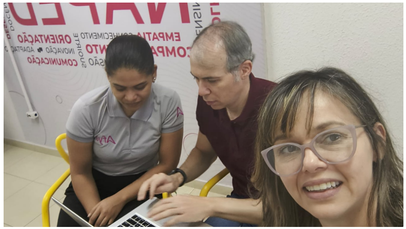

::: {.acao-figura}
{#fig-atendimento-canvas-equipe-naped fig-alt="Registro fotográfico de integrantes da equipe NAPED reunidos diante de um computador durante atendimento sobre o Canvas"}
:::

## Suporte próximo para o uso do Canvas

O NAPED realizou atendimento à equipe acadêmica para apoiar o uso do **Canvas**, ambiente virtual de aprendizagem utilizado nas atividades institucionais. O encontro foi dedicado à orientação prática, ao esclarecimento de dúvidas e ao acompanhamento das necessidades identificadas durante a utilização da plataforma.

Esse tipo de suporte aproxima a tecnologia da rotina pedagógica. Ao trabalhar junto com a equipe, o NAPED contribui para organizar recursos, fortalecer a autonomia dos usuários e favorecer uma experiência mais consistente para docentes e estudantes no ambiente virtual.

A ação também reforça o compromisso do NAPED com o acompanhamento contínuo das equipes e com a integração entre apoio pedagógico e tecnologias educacionais. O atendimento registrado constitui evidência do trabalho colaborativo voltado à melhoria dos processos de ensino e aprendizagem.

