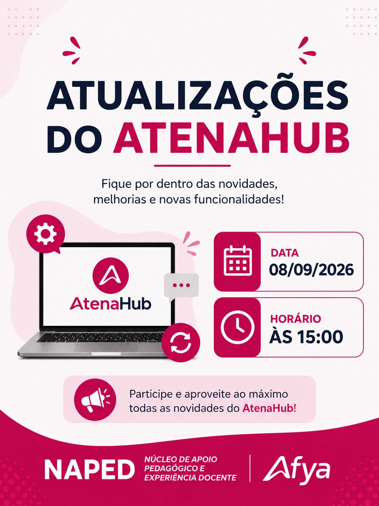
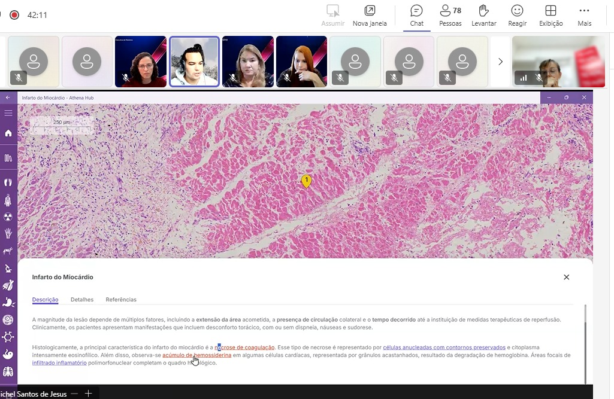
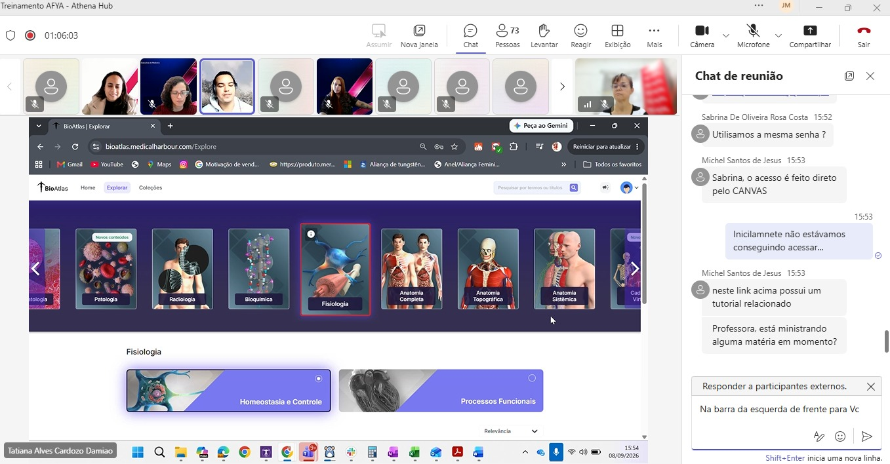

::: {.acao-figura}
{#fig-atualizacoes-atenahub fig-alt="Arte do NAPED Afya anunciando o encontro Atualizações do AtenaHub em 8 de setembro de 2026, às 15h"}
:::

## Tecnologias que apoiam a aprendizagem

Em 8 de setembro de 2026, o NAPED realizou o encontro on-line **Atualizações do AtenaHub**, voltado à apresentação de novidades, melhorias e novas funcionalidades da plataforma. A ação de formação docente favoreceu o diálogo sobre recursos digitais que podem ampliar as possibilidades de organização, exploração e acompanhamento da aprendizagem.

Durante a demonstração, foram apresentados ambientes e conteúdos disponíveis na plataforma, com destaque para o uso de atlas, recursos visuais e materiais interativos vinculados ao estudo de temas das ciências da saúde. A experiência permitiu aos participantes conhecer possibilidades de navegação e refletir sobre como esses recursos podem ser integrados aos percursos formativos.

Ao aproximar docentes das atualizações do AtenaHub, o encontro reforça o papel das tecnologias educacionais como apoio ao planejamento pedagógico e às metodologias ativas. A apropriação crítica desses recursos contribui para selecionar estratégias coerentes com os objetivos de aprendizagem, promover maior participação dos estudantes e diversificar as formas de acesso ao conhecimento.

## Evidências do encontro

::: {.acao-figura}
{#fig-atenahub-demonstracao-01 fig-alt="Captura de uma reunião on-line com demonstração de conteúdo histológico no AtenaHub" fig-cap="Demonstração de recursos do AtenaHub durante a formação."}
:::

::: {.acao-figura}
{#fig-atenahub-demonstracao-02 fig-alt="Captura de uma reunião on-line apresentando a área de exploração do BioAtlas no AtenaHub" fig-cap="Exploração de conteúdos e recursos visuais disponíveis na plataforma."}
:::
