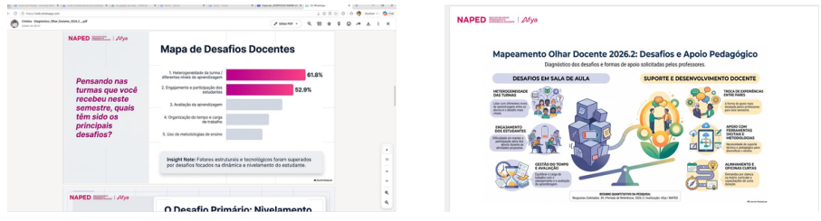

::: {.acao-figura}
{#fig-mapeamento-olhar-docente-01 fig-alt="Apresentação com o título Diagnóstico Institucional: Olhar Docente 2026.2 e o mapa de desafios docentes"}
:::

## Escuta docente para orientar o apoio pedagógico

Na reunião semanal do **NAPED, NED e Coordenação Acadêmica**, foi apresentada a síntese do **Mapeamento Olhar Docente 2026.2**. A iniciativa organiza a escuta dos professores e transforma os desafios percebidos no cotidiano acadêmico em subsídios para o planejamento do apoio pedagógico no semestre.

O diagnóstico apresenta um **Mapa de Desafios Docentes**, com aspectos relacionados à heterogeneidade das turmas, ao engajamento e à participação dos estudantes, à organização do tempo e à utilização de estratégias metodológicas. Entre os dados destacados nos slides, o desafio de atenção e participação aparece com 52,9% das respostas, sinalizando uma prioridade para a reflexão coletiva e para a construção de alternativas didáticas.

Mais do que um levantamento, o mapeamento aproxima evidências e ação. A análise orienta a definição de diretrizes de apoio, como a troca de experiências entre professores, o suporte ao uso de tecnologias educacionais, o alinhamento com a coordenação acadêmica e o desenvolvimento de estratégias para avaliação, gestão do tempo e participação discente.

Ao compartilhar os resultados com as equipes responsáveis pela formação e pelo acompanhamento acadêmico, o NAPED fortalece uma cultura de escuta, planejamento e melhoria contínua. A apresentação contribui para priorizar necessidades reais, articular respostas institucionais e apoiar os docentes na construção de experiências de aprendizagem mais significativas ao longo de 2026.2.

::: {.acao-figura}
{#fig-mapeamento-olhar-docente-02 fig-alt="Infográfico que relaciona desafios em sala de aula a ações de suporte e desenvolvimento docente"}
:::

