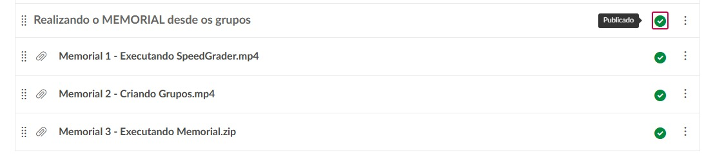

::: {.acao-figura}
{#fig-memorial-canvas-docentes fig-alt="Card institucional do NAPED orientando docentes a acessar vídeos curtos com o passo a passo para realizar o Memorial no Canvas"}
:::

## Orientação prática para o Memorial no Canvas

### Objetivo

Oferecer aos docentes orientações práticas para localizar, organizar e realizar o Memorial na plataforma **Canvas**, fortalecendo a autonomia no uso dos recursos digitais institucionais.

### Desenvolvimento

A partir de uma demanda observada junto aos docentes, a professora **Rafaela Drumond**, em parceria com a equipe do NAPED, elaborou uma sequência de vídeos instrucionais com orientações passo a passo. O material aborda a execução do SpeedGrader, a criação de grupos e a execução do arquivo do Memorial.

Os vídeos foram organizados no espaço do **Canvas do NAPED**, permitindo que os professores consultem as instruções de acordo com suas necessidades e acompanhem cada etapa do processo.

### Resultados e encaminhamentos

A disponibilização dos vídeos amplia o acesso a orientações objetivas, apoia o uso adequado do Canvas e contribui para a padronização dos procedimentos relacionados ao Memorial. O recurso permanece disponível para consulta dos docentes e integra as ações de formação e apoio pedagógico do NAPED.

### Evidências

::: {.acao-figura}
{#fig-memorial-canvas-docentes-modulo fig-alt="Tela do Canvas mostrando o módulo publicado Realizando o Memorial desde os grupos e três vídeos instrucionais sobre SpeedGrader, criação de grupos e execução do arquivo Memorial"}
:::
