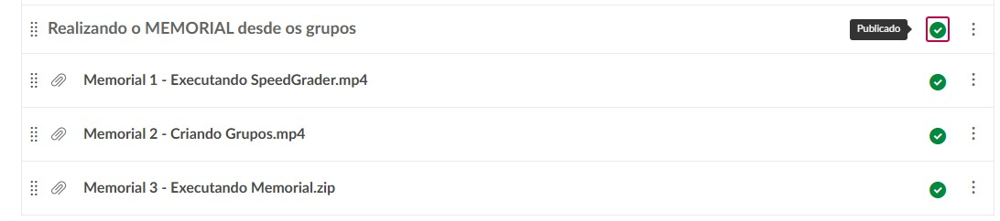
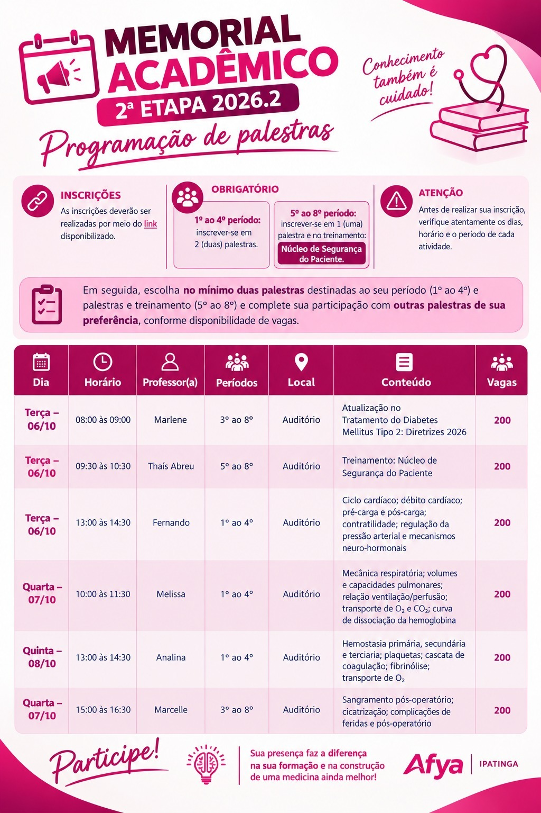

::: {.acao-figura}
{#fig-memorial-canvas-docentes fig-alt="Card institucional do NAPED orientando docentes a acessar vídeos curtos com o passo a passo para realizar o Memorial no Canvas"}
:::

## Orientação prática para o Memorial no Canvas

### Objetivo

Oferecer aos docentes orientações práticas para localizar, organizar e realizar o Memorial na plataforma **Canvas**, fortalecendo a autonomia no uso dos recursos digitais institucionais.

### Desenvolvimento

A partir de uma demanda observada junto aos docentes, a professora **Rafaela Drumond**, em parceria com a equipe do NAPED, elaborou uma sequência de vídeos instrucionais com orientações passo a passo. O material aborda a execução do SpeedGrader, a criação de grupos e a execução do arquivo do Memorial.

Os vídeos foram organizados no espaço do **Canvas do NAPED**, permitindo que os professores consultem as instruções de acordo com suas necessidades e acompanhem cada etapa do processo.

### Resultados e encaminhamentos

A disponibilização dos vídeos amplia o acesso a orientações objetivas, apoia o uso adequado do Canvas e contribui para a padronização dos procedimentos relacionados ao Memorial. O recurso permanece disponível para consulta dos docentes e integra as ações de formação e apoio pedagógico do NAPED.

### Evidências

::: {.acao-figura}
{#fig-memorial-canvas-docentes-modulo fig-alt="Tela do Canvas mostrando o módulo publicado Realizando o Memorial desde os grupos e três vídeos instrucionais sobre SpeedGrader, criação de grupos e execução do arquivo Memorial"}
:::

O material de divulgação da **2ª etapa do Memorial Acadêmico 2026.2** registra a programação de palestras e do treinamento do Núcleo de Segurança do Paciente, realizados entre 6 e 8 de outubro. A evidência reforça a atuação do NAPED na comunicação e no acompanhamento de atividades que apoiam a formação acadêmica dos estudantes.

::: {.acao-figura}
{#fig-memorial-academico-programacao fig-alt="Card com a programação de palestras da segunda etapa do Memorial Acadêmico 2026.2, incluindo datas, horários, professores, períodos, locais, conteúdos e vagas"}
:::

Como parte do apoio aos docentes, o NAPED também preparou e divulgou uma mensagem de orientação sobre o período do Memorial, o acesso ao Canvas e os canais de atendimento para dúvidas relacionadas ao acesso, à formação dos grupos e à localização das informações.

::: {.acao-figura}
{#fig-memorial-canvas-mensagem-docentes fig-alt="Card do NAPED com mensagem aos docentes sobre o Memorial de 6 a 9 de outubro, o acesso ao Canvas e o apoio para dúvidas"}
:::

O contato com os professores também foi realizado por meio de comunicação direta, reforçando a disponibilidade do NAPED para auxiliar em dúvidas sobre o Memorial. A orientação contemplou o acesso ao Canvas, a formação dos grupos, a localização dos materiais e os caminhos para solicitar apoio, fortalecendo o acompanhamento próximo dos docentes durante a atividade.

::: {.acao-figura}
{#fig-memorial-canvas-contato-docentes fig-alt="Card de comunicação do NAPED orientando docentes a acessar o Canvas e os vídeos de apoio sobre o Memorial"}
:::

Como evidência da atuação do NAPED, foi criado, dentro do módulo **2026/02 — Canvas NAPED**, o conteúdo **“Realizando o Memorial desde os grupos”**. O material reúne três vídeos de apoio aos professores: execução do SpeedGrader, criação dos grupos e execução do arquivo do Memorial.

A elaboração, organização e publicação desse recurso demandaram aproximadamente **5 horas de atuação**, contribuindo para ampliar a autonomia dos docentes e facilitar o acesso às orientações necessárias para a realização do Memorial.

::: {.acao-figura}
{#fig-memorial-canvas-modulo-videos fig-alt="Tela do módulo Realizando o Memorial desde os grupos no Canvas NAPED, com três vídeos publicados sobre SpeedGrader, criação de grupos e execução do Memorial"}
:::
