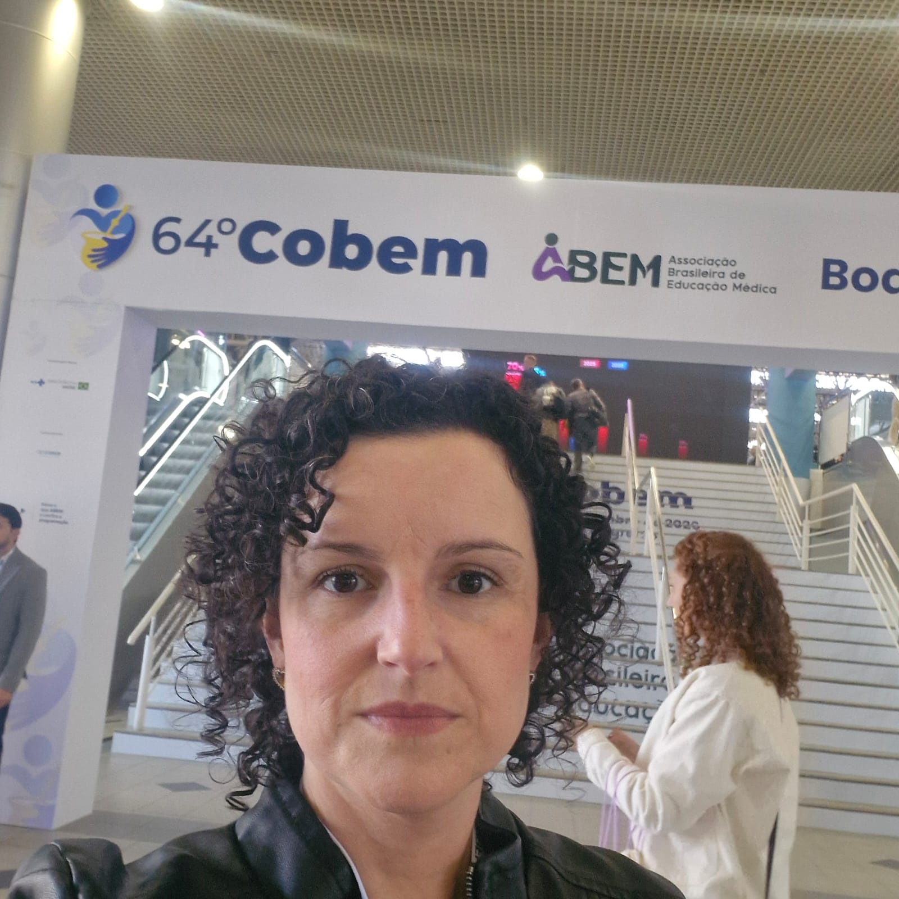
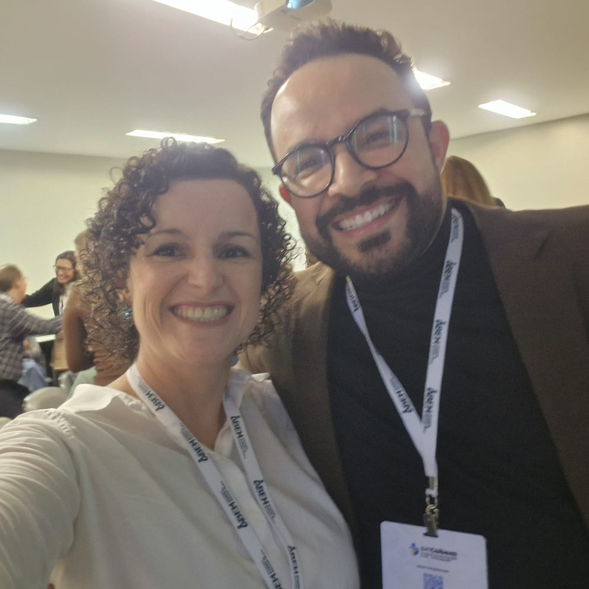
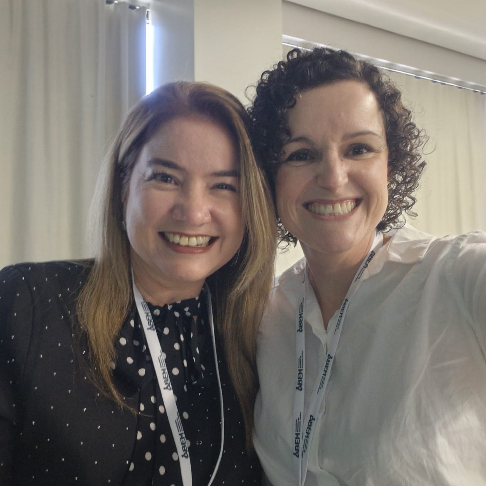

::: {.acao-figura}
{#fig-cobem-marita-novais fig-alt="Docente Marita Novais diante da identificação visual do 64º Congresso Brasileiro de Educação Médica"}
:::

## Sobre o evento

O 64º Congresso Brasileiro de Educação Médica (COBEM) foi realizado de 17 a 20 de setembro de 2026, no Centro de Eventos da Pontifícia Universidade Católica do Rio Grande do Sul (PUCRS), em Porto Alegre. Promovido pela Associação Brasileira de Educação Médica (ABEM), o encontro teve como tema central **“Diretrizes da Educação Médica: Avaliação e Qualidade a Serviço de Toda a Sociedade”**.

## Objetivos e programação

O congresso reuniu docentes, preceptores, estudantes, residentes, gestores, pesquisadores e profissionais da saúde para promover debates, troca de experiências e construção coletiva sobre os caminhos da formação médica no Brasil. A programação abordou avaliação e qualidade da formação, integração ensino-serviço-comunidade, responsabilidade social dos cursos de Medicina, formação no contexto do SUS e temas emergentes, como inteligência artificial, saúde digital, saúde planetária, saúde mental e bem-estar.

## Participação institucional

A docente Marita Novais participou do evento representando a Afya Ipatinga. Sua presença favoreceu o intercâmbio com profissionais e instituições de diferentes regiões do país, aproximando a unidade dos debates contemporâneos sobre educação médica e das experiências que podem contribuir para o aprimoramento das práticas pedagógicas locais.

## Registros

{fig-alt="Marita Novais com participante durante a programação do 64º COBEM"}

{fig-alt="Marita Novais e outra participante no 64º COBEM"}

## Fontes consultadas

- [ABEM — 64º COBEM em Porto Alegre](https://website.abem-educmed.org.br/64o-cobem-em-porto-alegre-celebra-encontros-conhecimento-e-a-transformacao-da-educacao-medica/)
- [HU Brasil — debates e perspectivas da rede hospitalar de ensino no COBEM](https://www.gov.br/hubrasil/pt-br/comunicacao/noticias/hu-brasil-discute-desafios-e-perspectivas-da-rede-hospitalar-de-ensino-em-congresso-de-educacao-medica)
