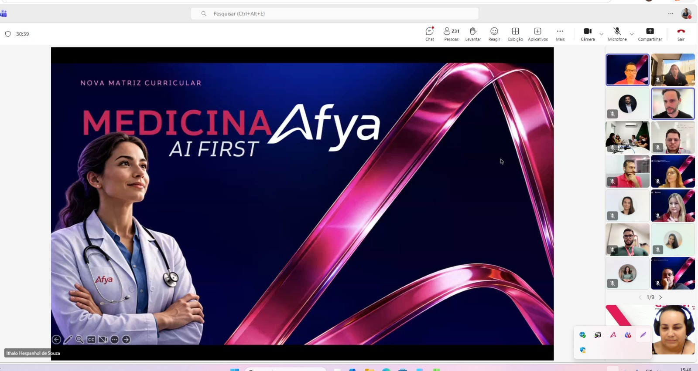
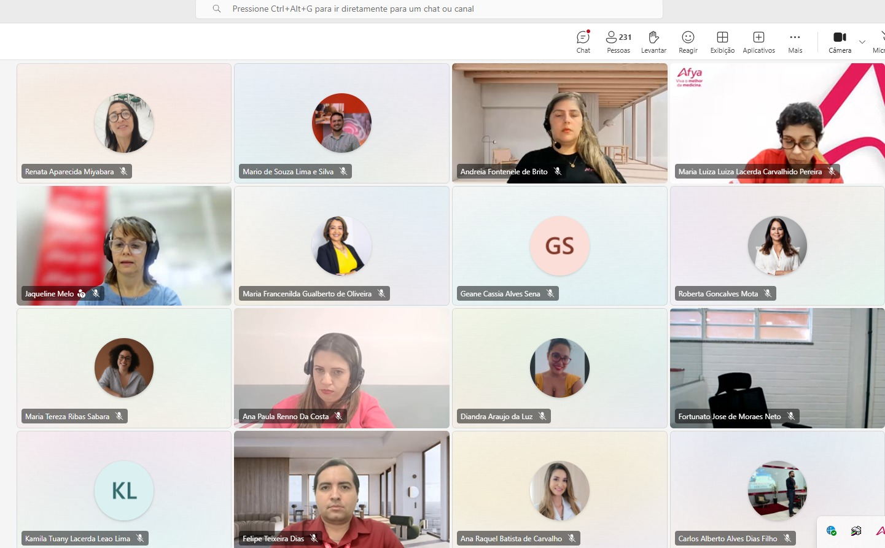

::: {.acao-figura}
{#fig-nova-matriz-2027 fig-alt="Tela de apresentação da Nova Matriz Curricular Medicina Afya AI First"}
:::

## Acompanhamento da nova matriz curricular

Em setembro de 2026, integrantes do NAPED participaram do encontro nacional de apresentação da **Nova Matriz Curricular Medicina Afya 2027**. A atividade reuniu profissionais de diferentes unidades para conhecer os direcionamentos da proposta curricular e dialogar sobre seus desdobramentos no planejamento e no acompanhamento pedagógico.

A participação possibilitou ao NAPED acompanhar as perspectivas da matriz e ampliar a compreensão sobre a organização dos percursos formativos, das experiências de aprendizagem e do apoio necessário à implementação local. O encontro também favoreceu a troca entre equipes, fortalecendo a articulação institucional diante das mudanças previstas para a formação médica.

Para o NAPED, estar presente nesses espaços é parte do compromisso com uma atuação pedagógica conectada às diretrizes institucionais e às necessidades de docentes e estudantes. O conhecimento compartilhado subsidiará ações de orientação, formação e acompanhamento que contribuam para uma transição responsável e coerente com os objetivos da nova matriz.

## Evidências de participação

::: {.acao-figura}
{#fig-nova-matriz-participacao-01 fig-alt="Captura de reunião on-line com participantes de diferentes unidades Afya" fig-cap="Participação de profissionais de diferentes unidades no encontro nacional."}
:::

::: {.acao-figura}
{#fig-nova-matriz-participacao-02 fig-alt="Captura de reunião on-line com integrantes do NAPED e demais participantes" fig-cap="Integração entre equipes durante a apresentação da nova matriz curricular."}
:::
