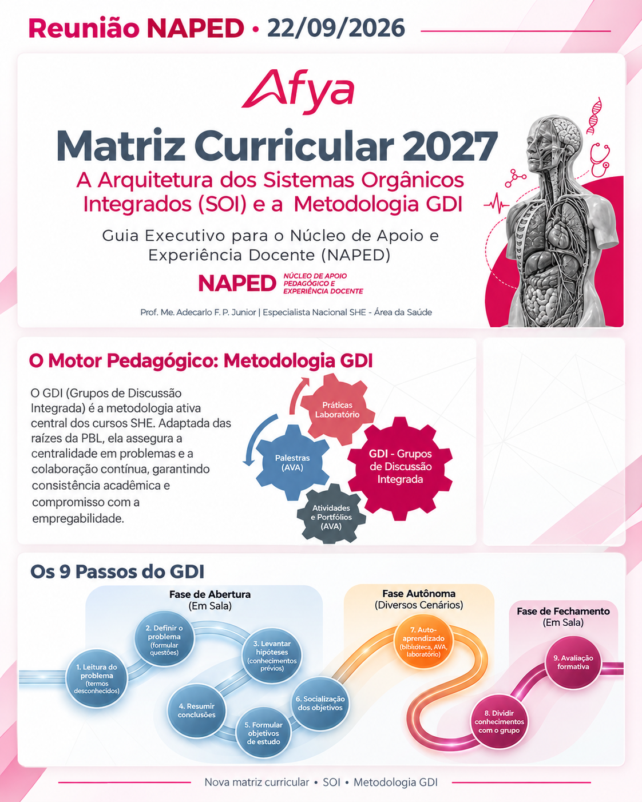

::: {.acao-figura}
{#fig-nova-matriz-2027 fig-alt="Composição visual da reunião do NAPED sobre a Matriz Curricular 2027, com os conteúdos de SOI, metodologia GDI e os nove passos do GDI"}
:::

## Acompanhamento da nova matriz curricular

Em **22 de setembro de 2026**, integrantes do NAPED participaram de uma reunião sobre a **Nova Matriz Curricular Medicina Afya 2027**. O encontro apresentou a arquitetura dos **Sistemas Orgânicos Integrados (SOI)** e a metodologia **GDI — Grupos de Discussão Integrada**, com condução do Prof. Me. Adecarlo F. P. Junior, especialista nacional SHE na área da saúde.

A apresentação discutiu o GDI como motor pedagógico dos cursos SHE, articulando palestras, atividades de portfólio, práticas de laboratório e grupos de discussão integrada. Também foram apresentados os nove passos do GDI, desde a leitura e definição do problema até a formulação dos objetivos de estudo, a socialização, o autoaprendizado, a divisão dos conhecimentos e a avaliação formativa.

Para o NAPED, participar desse alinhamento é parte do compromisso com uma atuação pedagógica conectada às diretrizes institucionais e às necessidades de docentes e estudantes. Os conhecimentos compartilhados subsidiam ações de orientação, formação e acompanhamento para uma implementação responsável e coerente com os objetivos da nova matriz.

## Evidências de participação

::: {.acao-figura}
{#fig-nova-matriz-reuniao-tratada fig-alt="Registro visual tratado da reunião do NAPED com os principais conteúdos apresentados sobre a nova matriz curricular, SOI e metodologia GDI" fig-cap="Composição visual criada a partir dos registros da reunião, sem a interface da plataforma de videoconferência."}
:::
