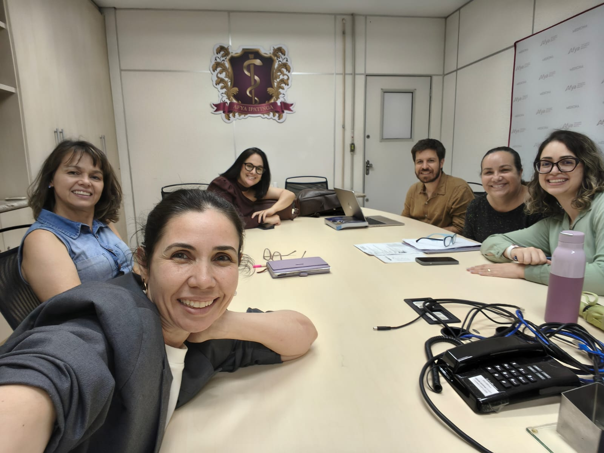

::: {.acao-figura}
{#fig-reuniao-alinhamento-naped fig-alt="Integrantes da equipe do NAPED reunidos ao redor de uma mesa na Afya Ipatinga"}
:::

## Objetivo

Alinhar orientações e procedimentos da equipe NAPED relacionados às Open Classes e a outros processos pedagógicos e operacionais da unidade.

## Desenvolvimento

Em 17 de setembro de 2026, a equipe do NAPED reuniu-se para tratar das orientações sobre as Open Classes, com atenção às etapas de planejamento, organização, acompanhamento e execução. O encontro também contemplou outros alinhamentos necessários à rotina do setor.

## Resultados e encaminhamentos

A reunião fortaleceu a comunicação interna, favoreceu a padronização dos processos e definiu encaminhamentos para apoiar a execução das atividades acadêmicas acompanhadas pelo NAPED.
