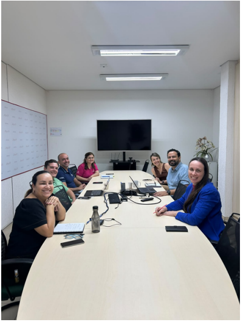

::: {.acao-figura}
{#fig-reuniao-comite-enamed fig-alt="Integrantes do Comitê ENAMED reunidos em sala na Afya Ipatinga"}
:::

## Planejamento coletivo para o acompanhamento acadêmico

O **Comitê ENAMED** se reuniu para discutir as ações que integram o Projeto ENAMED e alinhar os próximos passos do acompanhamento acadêmico dos estudantes. O encontro fortaleceu a organização coletiva das estratégias de preparação, orientação e monitoramento relacionadas ao exame.

Durante a reunião, os participantes compartilharam perspectivas sobre as necessidades dos estudantes e sobre as iniciativas que podem apoiar o desenvolvimento contínuo de conhecimentos e competências. A construção conjunta favorece a definição de prioridades, a integração entre as equipes e a coerência das ações desenvolvidas ao longo do percurso formativo.

O Comitê ENAMED tem papel essencial na articulação entre dados, planejamento pedagógico e suporte ao estudante. Ao manter espaços regulares de diálogo e decisão, a equipe contribui para que o Projeto ENAMED avance com intencionalidade, acompanhamento próximo e foco na qualidade da formação médica.
