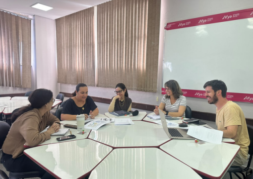

::: {.acao-figura}
{#fig-reuniao-quinzenal-alinhamento-naped fig-alt="Integrantes do NAPED reunidos em torno de uma mesa para planejamento e alinhamento das ações"}
:::

## Alinhamento contínuo para fortalecer as ações

Foi realizada a **reunião quinzenal de alinhamento do NAPED**, um espaço de planejamento colaborativo, acompanhamento das atividades em andamento e organização dos próximos encaminhamentos da equipe.

O encontro favorece a circulação de informações, a divisão de responsabilidades e a análise conjunta das demandas pedagógicas. Ao reunir a equipe regularmente, o NAPED consegue acompanhar prazos, revisar prioridades e manter as ações articuladas às necessidades de docentes e estudantes.

Mais do que uma reunião de rotina, o alinhamento quinzenal sustenta o trabalho integrado do núcleo e contribui para a continuidade das iniciativas de formação, apoio pedagógico e acompanhamento acadêmico desenvolvidas na instituição.

