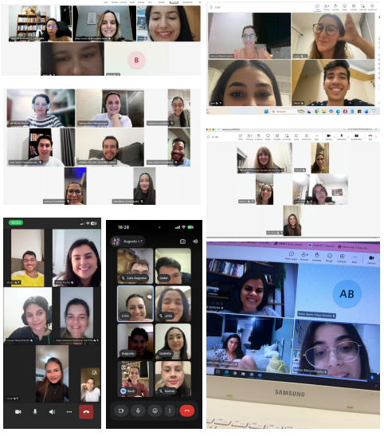

::: {.acao-figura}
{#fig-segundo-encontro-mentores-enamed fig-alt="Montagem de capturas de tela de mentores reunidos em encontros on-line do Projeto ENAMED"}
:::

## Mentoria que acompanha e orienta

O **2º encontro de mentores do Projeto ENAMED** reuniu participantes para fortalecer o alinhamento das ações de acompanhamento acadêmico. O momento permitiu compartilhar experiências, discutir necessidades observadas no percurso dos estudantes e organizar estratégias de orientação relacionadas à preparação para o ENAMED.

No projeto, a mentoria é um espaço de proximidade e escuta. Ao acompanhar o desempenho, as dúvidas e os desafios de estudo, os mentores podem contribuir para que os estudantes reconheçam seus avanços, priorizem necessidades de aprendizagem e construam caminhos mais autônomos e consistentes.

O encontro também reforçou a importância da atuação articulada entre mentores e equipes pedagógicas. A troca entre os participantes favorece decisões mais qualificadas, amplia o repertório de apoio e mantém o Projeto ENAMED conectado à realidade dos estudantes e aos objetivos da formação médica.

Como primeira ação registrada no projeto, este segundo encontro inaugura um acervo de experiências que evidenciará o desenvolvimento contínuo da mentoria, dos simulados, das revisões e das demais estratégias de preparação acadêmica.
