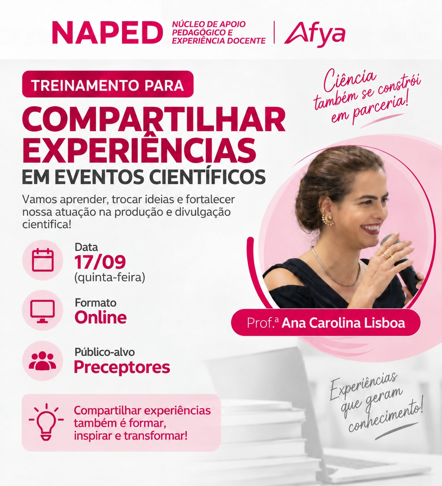

::: {.acao-figura}
{#fig-treinamento-experiencias fig-alt="Arte do treinamento on-line para preceptores sobre compartilhamento de experiências em eventos científicos, conduzido pela professora Ana Carolina Lisboa em 17 de setembro"}
:::

## Formação para preceptores

Em 17 de setembro de 2026, o NAPED promoveu o treinamento on-line **Compartilhar experiências em eventos científicos**, destinado aos preceptores e conduzido pela Prof.ª Ana Carolina Lisboa. A atividade foi organizada como um espaço de aprendizagem, troca de ideias e fortalecimento da atuação dos participantes na produção e na divulgação científica.

O encontro valorizou as experiências vividas nos cenários de ensino e de serviço como fontes legítimas de conhecimento. Ao compartilhar práticas, desafios, estratégias e resultados, os preceptores ampliam as possibilidades de registro, reflexão e circulação de saberes que contribuem para a formação em saúde.

A iniciativa reforça que a ciência também se constrói em parceria: transformar experiências em relatos e apresentações para eventos científicos favorece a visibilidade de boas práticas, inspira outros profissionais e fortalece uma cultura de formação contínua e colaborativa.
