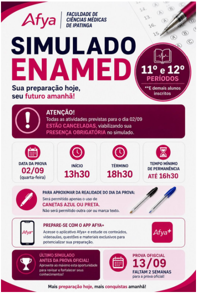

::: {.acao-figura}
{#fig-ultimo-simulado-enamed fig-alt="Arte do simulado ENAMED para estudantes do 11º e 12º períodos, realizado em 2 de setembro de 2026"}
:::

## Etapa final de preparação

O **último simulado ENAMED antes da prova oficial** foi realizado como uma oportunidade de preparação para os estudantes do 11º e 12º períodos. A atividade buscou aproximar os participantes das condições de prova e apoiar a organização dos estudos na reta final.

Além de revisar conteúdos, o simulado favoreceu a experiência de gestão do tempo, concentração e tomada de decisão diante das questões. A vivência em um formato próximo ao da avaliação permite que os estudantes reconheçam seus pontos fortes, identifiquem temas que ainda demandam atenção e ajustem estratégias de estudo.

No Projeto ENAMED, os simulados constituem instrumentos de acompanhamento e aprendizagem. Eles oferecem dados e experiências que ajudam cada estudante a transformar a preparação em um percurso mais consciente, estruturado e alinhado aos desafios da formação médica.
