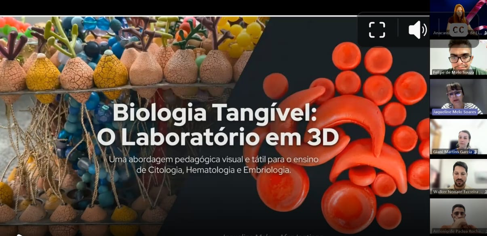
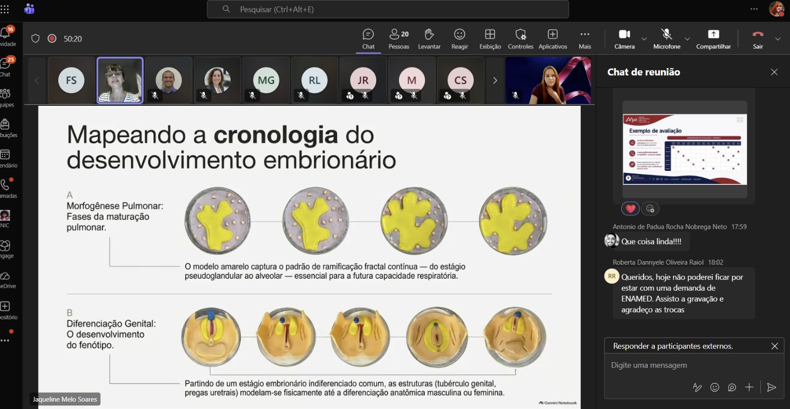

::: {.acao-figura}
{#fig-vitrine-soi fig-alt="Tela da apresentação Biologia Tangível: o Laboratório em 3D, com modelos didáticos tridimensionais e participantes do encontro on-line"}
:::

## Participação nacional

Em 11 de setembro de 2026, a Afya Ipatinga participou do encontro nacional que marcou a inauguração da **Vitrine do SOI**, iniciativa que reuniu diferentes unidades da Afya para compartilhar experiências pedagógicas relacionadas aos Sistemas Orgânicos Integrados.

A instituição foi representada por **Jaqueline Melo Soares**, especialista dos eixos SOI 1 e SOI 2 da Afya Ipatinga. Na ocasião, ela demonstrou a aplicação de modelos e jogos nas estações de laboratório, evidenciando como esses recursos podem apoiar a visualização de processos biológicos, a participação ativa dos estudantes e o alcance dos objetivos de aprendizagem.

O encontro reforçou a importância do intercâmbio entre unidades e da divulgação de estratégias que aproximam os conteúdos teóricos de experiências práticas, táteis e colaborativas. A participação da Afya Ipatinga integra o acervo de ações do NAPED como registro de representação institucional e de compartilhamento de boas práticas.

## Evidências

{fig-alt="Tela de reunião on-line com participantes de diferentes unidades da Afya"}

{fig-alt="Tela de apresentação com modelos tridimensionais usados para mapear a cronologia do desenvolvimento embrionário"}

{fig-alt="Tela de reunião on-line com participantes e chat do encontro"}
