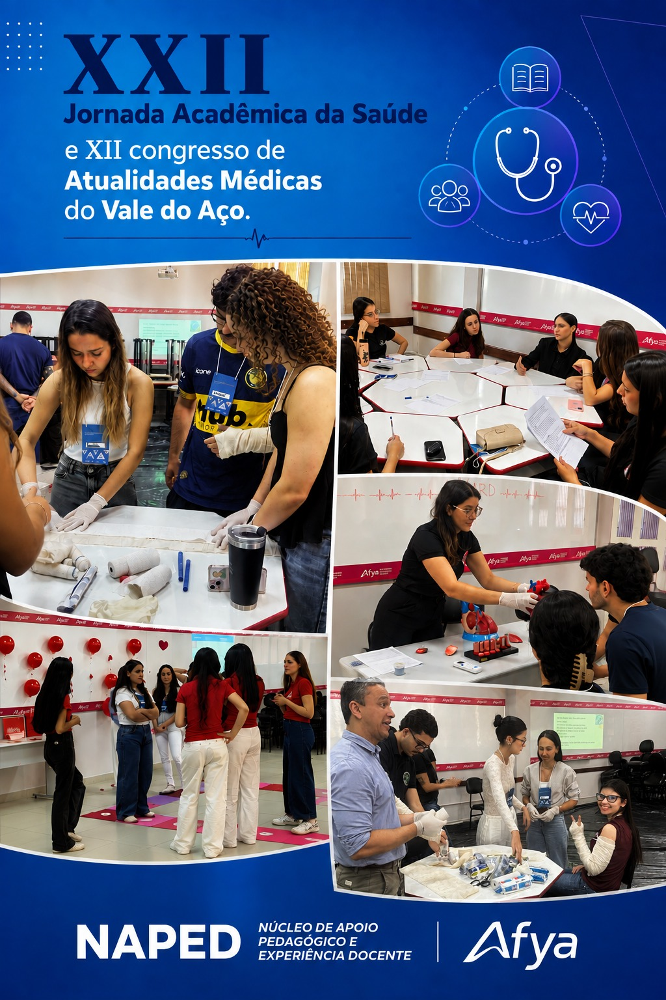

::: {.acao-figura}
{#fig-jornada-academica-saude fig-alt="Arte da XXII Jornada Acadêmica da Saúde com registros de oficinas práticas realizadas na Afya Ipatinga"}
:::

## Primeiro dia de aprendizagem e integração

A Afya Ipatinga iniciou a **XXII Jornada Acadêmica da Saúde** e o **XII Congresso de Atualidades Médicas do Vale do Aço**, reunindo a comunidade acadêmica em uma programação voltada ao aprendizado, à prática e à integração. O primeiro dia foi marcado por oficinas que aproximam os estudantes de situações relevantes para a formação e para o cuidado em saúde.

No período da manhã, foram realizadas sessões sobre prescrição em Pediatria e treinamento de imobilizações ortopédicas. As atividades ofereceram oportunidades de exercitar conhecimentos e habilidades em um ambiente orientado, fortalecendo a articulação entre fundamentos teóricos e práticas clínicas.

À tarde, a programação segue com oficinas de hematologia, interpretação do eletrocardiograma na dor torácica, acesso venoso guiado por ultrassonografia, trabalho de parto, biossensores e outros temas. A diversidade de abordagens amplia o contato dos participantes com áreas e procedimentos que integram o cotidiano profissional.

O encerramento do dia contará com a Abertura Oficial da Jornada. A iniciativa reafirma o compromisso da Afya Ipatinga e do NAPED com experiências acadêmicas que promovem participação, colaboração e formação em saúde orientada pelas necessidades da prática.
