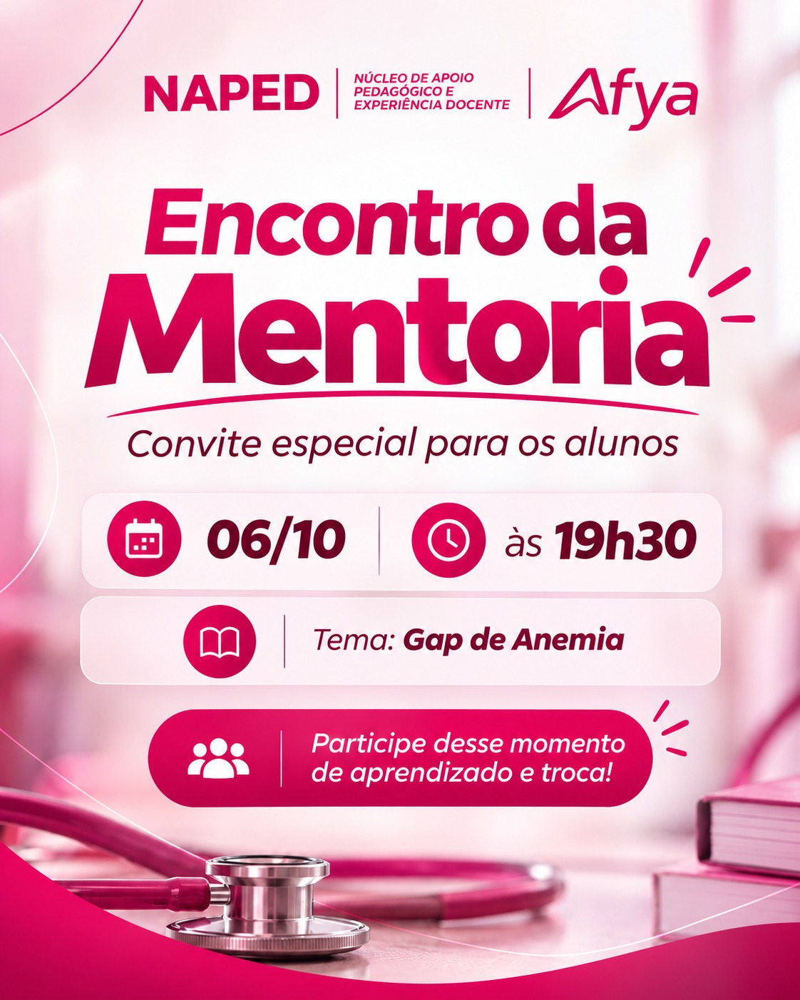

::: {.acao-figura}
{#fig-encontro-mentoria-gap-anemia fig-alt="Card do NAPED convidando estudantes para encontro de mentoria do Projeto ENAMED, em 6 de outubro, às 19h30, com o tema Gap de Anemia"}
:::

## Mentoria ENAMED para fortalecer a aprendizagem

### Objetivo

Promover um momento de estudo, diálogo e acompanhamento acadêmico sobre o tema **Gap de Anemia**, contribuindo para a preparação dos estudantes para os desafios do ENAMED.

### Desenvolvimento

No dia **6 de outubro, às 19h30**, a professora **Marita de Novais Costa Salles de Almeida**, mentora e integrante do NAPED, conduzirá um encontro com os estudantes do Projeto ENAMED. A atividade será dedicada à discussão do tema, à revisão de conhecimentos e à troca de experiências relacionadas à formação médica.

### Resultados e encaminhamentos

O encontro integra as ações de mentoria do Projeto ENAMED e amplia as oportunidades de acompanhamento próximo dos estudantes. A proposta é favorecer a participação ativa, o esclarecimento de dúvidas e a construção de estratégias de estudo alinhadas às necessidades identificadas no percurso acadêmico.

### Evidência

O card de divulgação registra a data, o horário, o tema e o convite aos estudantes para participação no encontro de mentoria.
