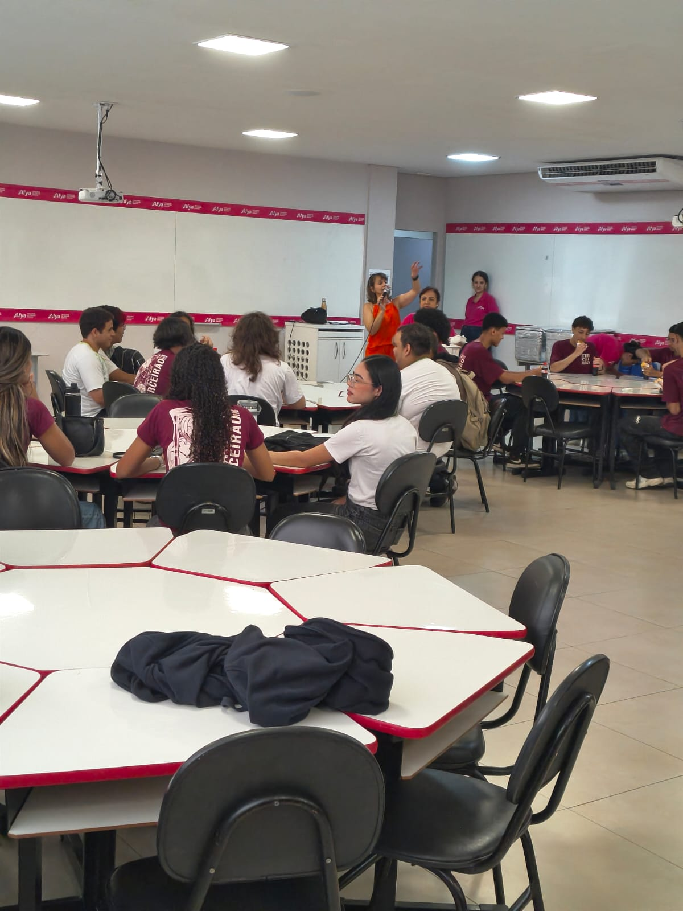
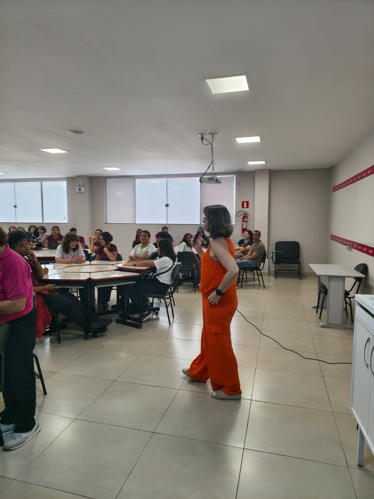
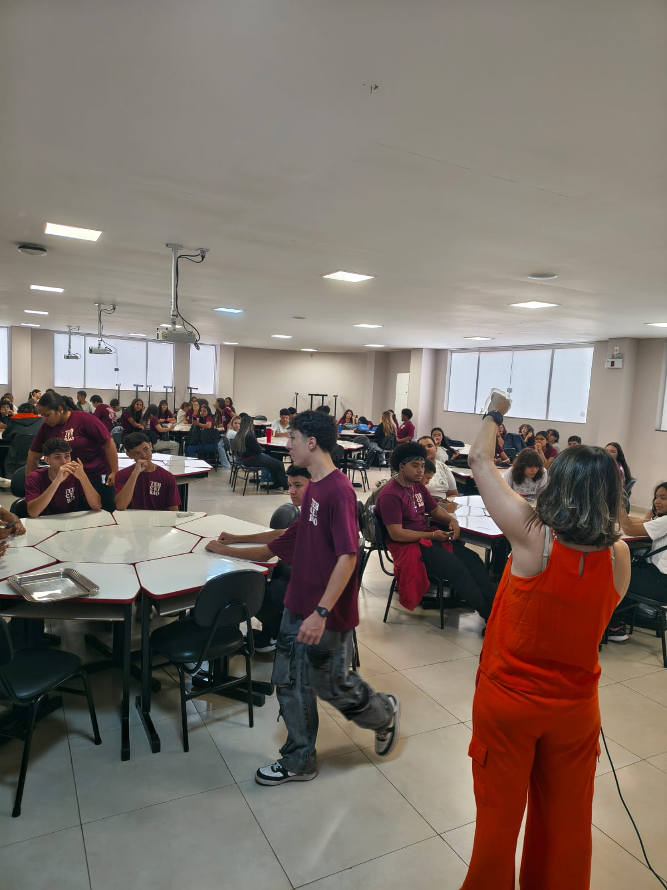

::: {.acao-figura}
{#fig-openday-metodologias-ativas fig-alt="Professora conduzindo uma atividade para estudantes do Ensino Médio em uma sala da Afya Ipatinga durante o Open Day"}
:::

## NAPED presente no Open Day

### Objetivo

Apresentar aos estudantes do 3º ano do Ensino Médio aspectos da metodologia ativa adotada na Afya Ipatinga, aproximando a comunidade da proposta pedagógica e da estrutura dos cursos oferecidos pela instituição.

### Desenvolvimento

Durante o **Open Day**, iniciativa que abre a faculdade para a comunidade, a professora **Jaqueline Melo Soares**, integrante do NAPED, conduziu uma atividade sobre metodologias ativas com os estudantes do terceiro ano do Ensino Médio.

O encontro promoveu diálogo, participação e contato com estratégias de aprendizagem que fazem parte da formação acadêmica. A ação também possibilitou apresentar aos visitantes os espaços, a organização e as experiências que compõem a trajetória dos estudantes na Afya.

### Resultados e encaminhamentos

A participação do NAPED contribuiu para aproximar os estudantes da realidade acadêmica, esclarecer dúvidas e tornar mais conhecida a proposta de formação da Afya Ipatinga. A atividade reforça o compromisso do núcleo com a comunicação institucional, a inovação pedagógica e o diálogo com a comunidade.

### Evidências

::: {.acao-figura}
{#fig-openday-metodologias-ativas-dialogo fig-alt="Professora em pé dialogando com estudantes reunidos em uma sala durante o Open Day"}
:::

::: {.acao-figura}
{#fig-openday-metodologias-ativas-participacao fig-alt="Estudantes reunidos em mesas participando de uma atividade conduzida durante o Open Day"}
:::
