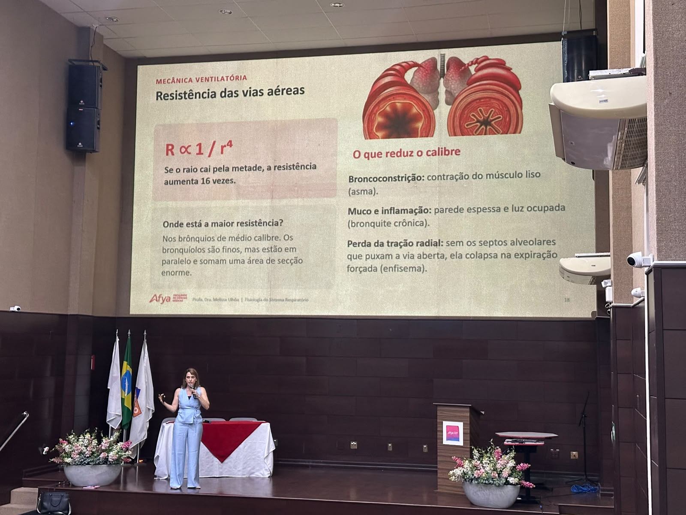
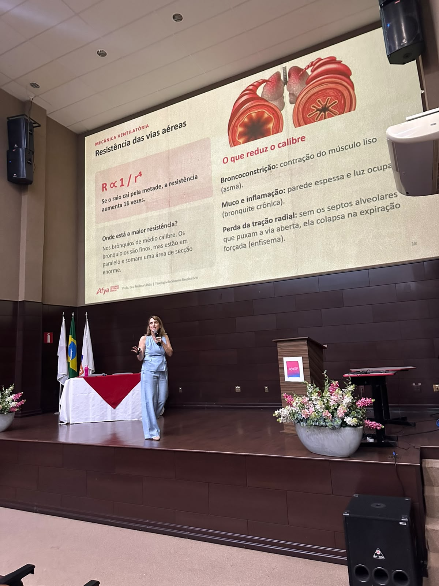
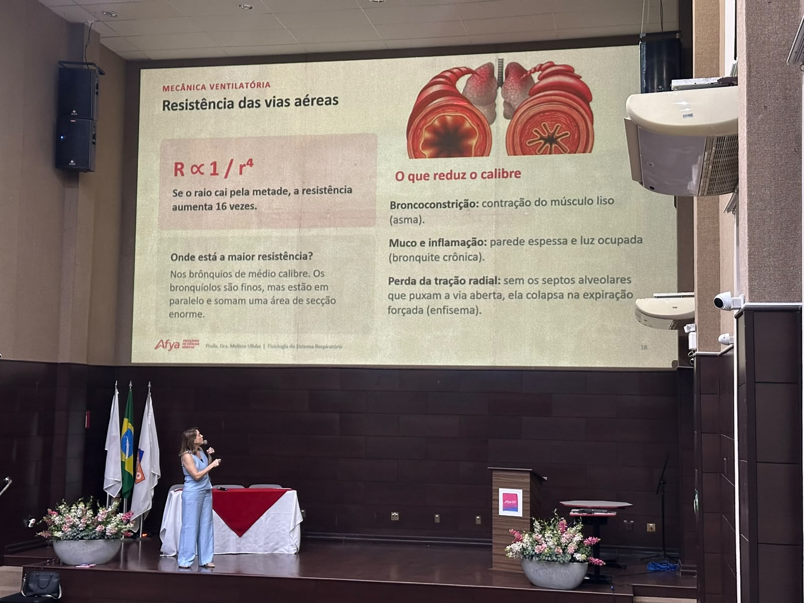
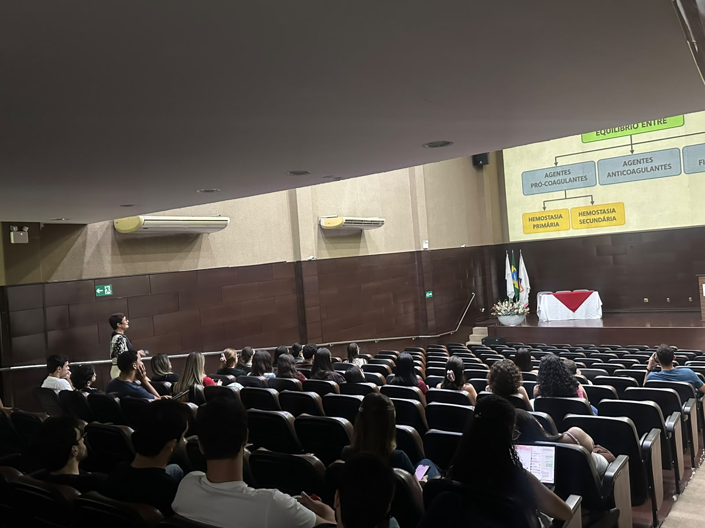
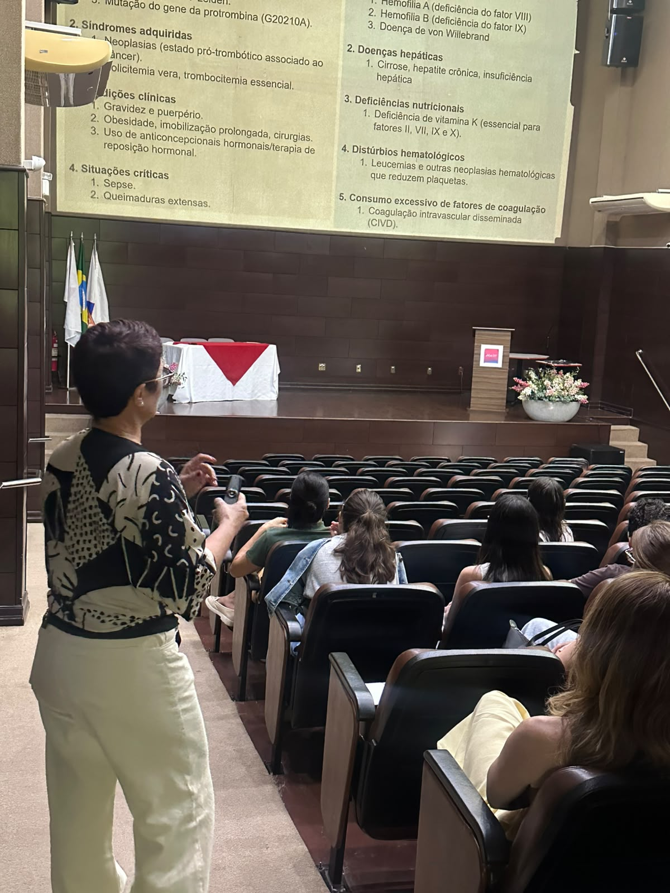
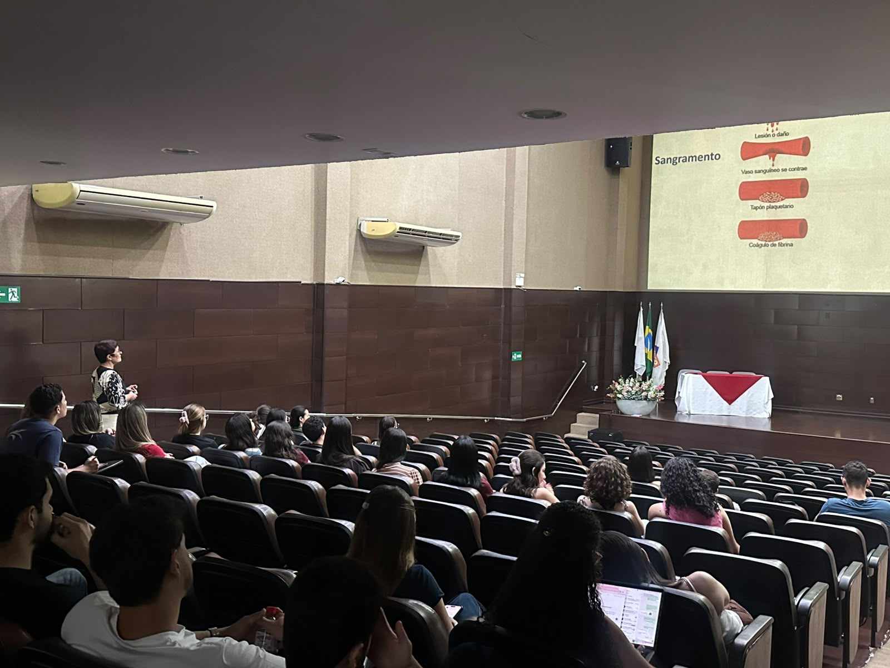
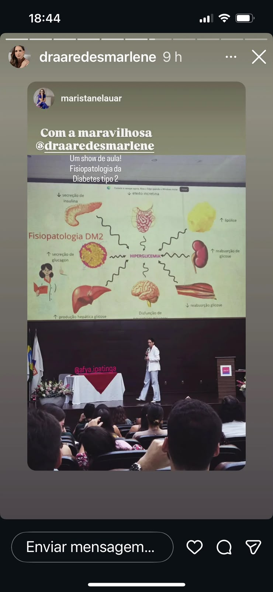
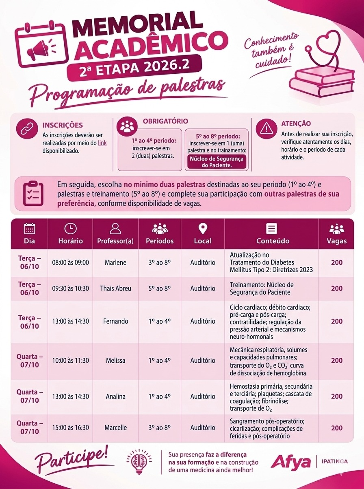

::: {.acao-figura}
{#fig-semana-memorial-melissa-ulhoa fig-alt="Professora Melissa Araújo Ulhoa Quintão falando ao microfone em um auditório, diante de um slide sobre resistência das vias aéreas"}
:::

## Semana do Memorial: integração entre avaliação e aprendizagem

### Objetivo

Fortalecer a aprendizagem dos estudantes durante a Semana do Memorial Acadêmico, conectando a retomada de conhecimentos essenciais à reflexão sobre o próprio percurso formativo.

### Palestras registradas na programação

- **6 de outubro — Prof.ª Dra. Marlene Aredes Mota:** atualização e intensificação do tratamento do Diabetes Mellitus tipo 2, conforme as Diretrizes SBD 2026.
- **7 de outubro — Prof.ª Dra. Melissa Araújo Ulhoa Quintão:** mecânica ventilatória e resistência das vias aéreas.
- **7 de outubro — Prof.ª Dra. Analina Furtado Valadão:** hemostasia e coagulação.

### Desenvolvimento

No dia **7 de outubro de 2026**, a Afya Ipatinga participou da programação da Semana do Memorial Acadêmico com uma palestra da **Prof.ª Dra. Melissa Araújo Ulhoa Quintão**, professora da instituição. A atividade abordou **mecânica ventilatória** e **resistência das vias aéreas**, explorando a relação entre o calibre dos brônquios, a broncoconstrição, o muco e a inflamação e a perda da tração radial.

A Semana do Memorial Acadêmico integra uma proposta de avaliação global e formativa da rede Afya. Em [orientações institucionais da rede](https://faculdades.afya.com.br/noticias/semana-do-memorial-academico-na-afya-palmas), o percurso envolve autoavaliação, elaboração de plano de ação e devolutiva com o docente, com registros realizados no Canvas. Nesse contexto, a palestra ampliou o repertório dos estudantes e aproximou os conteúdos de fisiologia das discussões formativas do Memorial.

No mesmo dia, a programação contou também com a palestra da **Prof.ª Dra. Analina Furtado Valadão**, que abordou a **hemostasia e a coagulação**. A exposição apresentou o equilíbrio entre agentes pró-coagulantes e anticoagulantes, as etapas da hemostasia primária e secundária e situações clínicas relacionadas a alterações da coagulação, favorecendo a integração entre os conceitos fundamentais e sua aplicação na formação médica.

No dia **6 de outubro de 2026**, a programação recebeu a palestra da **Prof.ª Dra. Marlene Aredes Mota**, dedicada à **atualização no tratamento do Diabetes Mellitus tipo 2**. A exposição discutiu a fisiopatologia da doença e a intensificação do tratamento conforme as **Diretrizes SBD 2026**, relacionando mecanismos fisiológicos, tomada de decisão terapêutica e cuidado clínico baseado em evidências.

### Resultados e encaminhamentos

O encontro proporcionou uma revisão conceitual aplicada, favoreceu a participação dos estudantes e reforçou a integração entre atividades acadêmicas e acompanhamento formativo. A iniciativa evidencia a atuação do NAPED no apoio à organização de ações que contribuem para uma experiência de aprendizagem articulada durante o Memorial.

### Evidências

::: {.acao-figura}
{#fig-semana-memorial-melissa-ulhoa-palestra fig-alt="Professora Melissa Ulhoa ministrando palestra em auditório, com slide sobre mecânica ventilatória projetado ao fundo"}
:::

::: {.acao-figura}
{#fig-semana-memorial-melissa-ulhoa-slide fig-alt="Professora em palco apresentando slide sobre resistência das vias aéreas, broncoconstrição, muco e inflamação"}
:::

::: {.acao-figura}
{#fig-semana-memorial-analina-valadao fig-alt="Estudantes no auditório acompanhando uma apresentação sobre hemostasia e coagulação durante a Semana do Memorial"}
:::

::: {.acao-figura}
{#fig-semana-memorial-analina-valadao-palestra fig-alt="Professora Analina em pé no auditório, conduzindo a apresentação para os estudantes"}
:::

::: {.acao-figura}
{#fig-semana-memorial-analina-valadao-slide fig-alt="Slide projetado no auditório com as etapas de resposta ao sangramento: contração do vaso, tampão plaquetário e coágulo de fibrina"}
:::

::: {.acao-figura}
{#fig-semana-memorial-marlene-aredes-mota fig-alt="Professora Marlene Aredes Mota ministrando palestra para estudantes no auditório durante a Semana do Memorial"}
:::

::: {.acao-figura}
{#fig-semana-memorial-marlene-aredes-mota-tratamento fig-alt="Professora Marlene Aredes Mota apresentando conteúdo sobre atualização no tratamento do Diabetes Mellitus tipo 2"}
:::

::: {.acao-figura}
{#fig-semana-memorial-marlene-aredes-mota-slide fig-alt="Slide da palestra com o tema Intensificação de tratamento de Diabetes Mellitus tipo 2 e referência às Diretrizes SBD 2026"}
:::

O card oficial da **2ª etapa do Memorial Acadêmico 2026.2** também integra este registro como evidência da proposta. A peça reúne orientações de inscrição, atividades obrigatórias por período, horários, professores, conteúdos e locais das palestras e do treinamento do Núcleo de Segurança do Paciente.

::: {.acao-figura}
{#fig-memorial-academico-programacao-atualizada fig-alt="Card do Memorial Acadêmico 2026.2 com orientações de inscrição e programação de palestras dos dias 6 e 7 de outubro na Afya Ipatinga"}
:::
