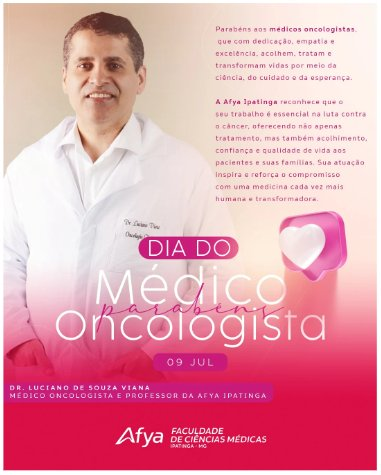
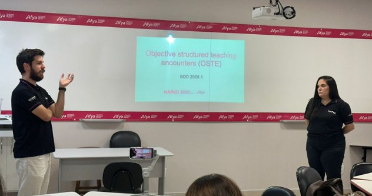

Linha do tempo · 2026

<article class="action-card">
  
  

22/07/2026
Comunicação InstitucionalValorização Docente
  <h3><a href="../acoes/2026-07-homenagem-oncologista-pediatra-cirurgiao.html">Dia do Oncologista, do Pediatra e do Cirurgião Geral</a></h3>
Homenagem de julho aos docentes das especialidades de Oncologia, Pediatria e Cirurgia Geral.

</article>
<article class="action-card">
  
  

15/07/2026
Acolhimento DocenteComunicação Institucional
  <h3><a href="../acoes/2026-07-volta-as-aulas-2026-2.html">Volta às Aulas — Semestre 2026.2</a></h3>
Acolhimento do corpo docente no início do semestre 2026.2, com mensagens personalizadas e painel de boas-vindas.

</article>
<article class="action-card">
  
  

08/07/2026
Formação DocenteInovação Pedagógica
  <h3><a href="../acoes/2026-07-oficina-oste-sdd.html">Oficina OSTE — Semana de Desenvolvimento Docente</a></h3>
Oficina com a metodologia OSTE (Objective Structured Teaching Encounters) na SDD da Afya Ipatinga, com simulação e feedback estruturado para docentes.

</article>
<article class="action-card">
  
  

01/07/2026
Formação DocenteComunicação Institucional
  <h3><a href="../acoes/2026-07-sdd-semana-desenvolvimento-docente.html">SDD — Semana de Desenvolvimento Docente</a></h3>
Identidade visual e programação da SDD 2026.1, com cards informativos da agenda, horários, atividades e responsáveis.

</article>

