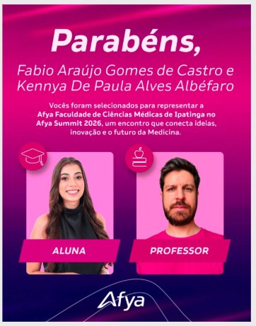

Linha do tempo · 2026

<article class="action-card">
  
  

20/08/2026
Formação DocenteProdução de Conhecimento
  <h3><a href="../acoes/2026-08-docencia-em-foco-ia-pesquisa.html">Docência em Foco (Agosto) — IA em Pesquisas e Publicações Acadêmicas</a></h3>
Edição de agosto da série Docência em Foco sobre o uso da Inteligência Artificial em pesquisas e publicações acadêmicas.

</article>
<article class="action-card">
  
  

01/08/2026
Formação DocenteProdução de Conhecimento
  <h3><a href="../acoes/2026-08-afya-summit-2026.html">Afya Summit 2026 — Representação da Afya Ipatinga</a></h3>
Kennya De Paula Alves Albéfaro e o professor Fabio Araújo Gomes de Castro selecionados para representar a Afya Faculdade de Ciências Médicas de Ipatinga no Afya Summit 2026.

</article>

