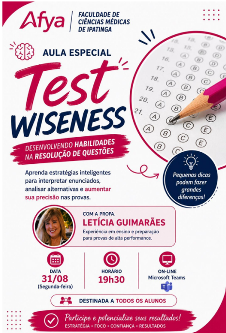
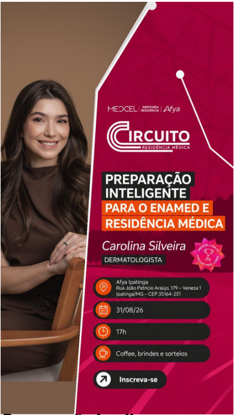
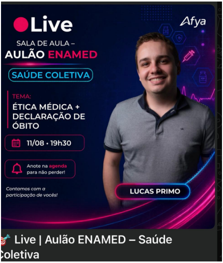
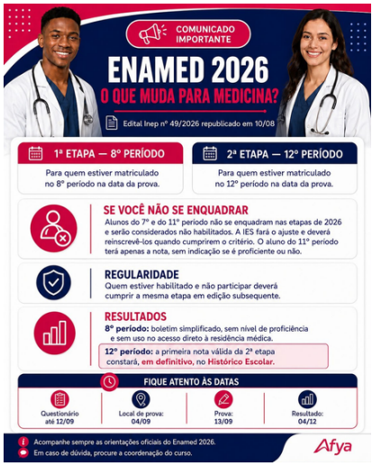

Linha do tempo · 2026

<article class="action-card">
  
  

31/08/2026
Acompanhamento AcadêmicoPreparação ENAMED
  <h3><a href="../acoes/2026-08-test-wiseness-enamed.html">Aula especial Test Wiseness — Projeto ENAMED</a></h3>
Aula com a Prof.ª Letícia Guimarães sobre estratégias para interpretar enunciados, analisar alternativas e resolver questões de prova.

</article>
<article class="action-card">
  
  

31/08/2026
Acompanhamento AcadêmicoPreparação ENAMED
  <h3><a href="../acoes/2026-08-circuito-residencia-enamed.html">Circuito Residência Médica — Preparação inteligente para ENAMED e residência</a></h3>
Encontro especial com Carolina Silveira da Silva sobre preparação estratégica para o ENAMED e a residência médica.

</article>
<article class="action-card">
  
  

20/08/2026
Formação DocenteProdução de Conhecimento
  <h3><a href="../acoes/2026-08-docencia-em-foco-ia-pesquisa.html">Docência em Foco (Agosto) — IA em Pesquisas e Publicações Acadêmicas</a></h3>
Edição de agosto da série Docência em Foco sobre o uso da Inteligência Artificial em pesquisas e publicações acadêmicas.

</article>
<article class="action-card">
  
  

11/08/2026
Acompanhamento AcadêmicoPreparação ENAMED
  <h3><a href="../acoes/2026-08-aulao-enamed-saude-coletiva.html">Aulão ENAMED — Saúde Coletiva</a></h3>
Aulão preparatório para o ENAMED sobre ética médica e declaração de óbito, conduzido por Lucas Primo.

</article>
<article class="action-card">
  
  

10/08/2026
Acompanhamento AcadêmicoOrientação Discente
  <h3><a href="../acoes/2026-08-atualizacao-edital-inep-49-enamed.html">Atualização do Edital Inep nº 49/2026 — ENAMED</a></h3>
Orientação acadêmica sobre a republicação do Edital Inep nº 49/2026 e as duas etapas obrigatórias do ENAMED para estudantes de Medicina.

</article>
<article class="action-card">
  
  

08/08/2026
Formação DocenteProjetos Institucionais
  <h3><a href="../acoes/2026-08-terceiro-encontro-projeto-move.html">3º encontro e encerramento da turma 2026/1 — Projeto MOVE</a></h3>
Encontro de encerramento da turma 2026/1 do Projeto MOVE, dedicado à socialização de estratégias ativas aplicadas nas práticas pedagógicas.

</article>
<article class="action-card">
  
  

01/08/2026
Formação DocenteReconhecimento Acadêmico
  <h3><a href="../acoes/2026-08-melissa-selecao-sthem-2026.html">Prof.ª Melissa Araújo Ulhoa Quintão no STHEM 2026</a></h3>
Seleção da Prof.ª Melissa Araújo Ulhoa Quintão para o Programa Educadores Multiplicadores do XIII Programa de Formação de Professores STHEM 2026.

</article>
<article class="action-card">
  
  

01/08/2026
Formação DocenteProdução de Conhecimento
  <h3><a href="../acoes/2026-08-afya-summit-2026.html">Afya Summit 2026 — Representação da Afya Ipatinga</a></h3>
Kennya De Paula Alves Albéfaro e o professor Fabio Araújo Gomes de Castro selecionados para representar a Afya Faculdade de Ciências Médicas de Ipatinga no Afya Summit 2026.

</article>

