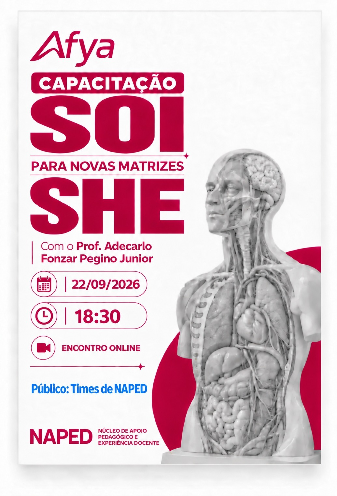

Linha do tempo · 2026

<article class="action-card">
  
  

22/09/2026
Formação DocenteGestão Pedagógica
  <h3><a href="../acoes/2026-09-capacitacao-soi-novas-matrizes-she.html">Capacitação SOI para novas matrizes SHE</a></h3>
Formação on-line exclusiva para o time NAPED, voltada ao alinhamento sobre o SOI nas novas matrizes SHE.

</article>
<article class="action-card">
  
  

17/09/2026
Gestão PedagógicaComunicação Institucional
  <h3><a href="../acoes/2026-09-reuniao-alinhamento-equipe-naped.html">Reunião de alinhamento da equipe NAPED</a></h3>
Encontro da equipe para orientações sobre as Open Classes, seus processos de execução e outros alinhamentos pedagógicos e operacionais.

</article>
<article class="action-card">
  
  

17/09/2026
Formação DocenteProdução de Conhecimento
  <h3><a href="../acoes/2026-09-participacao-64-cobem-marita-novais.html">Participação no 64º Congresso Brasileiro de Educação Médica</a></h3>
A docente Marita Novais representou a Afya Ipatinga no 64º COBEM, realizado de 17 a 20 de setembro de 2026, na PUCRS, em Porto Alegre.

</article>

