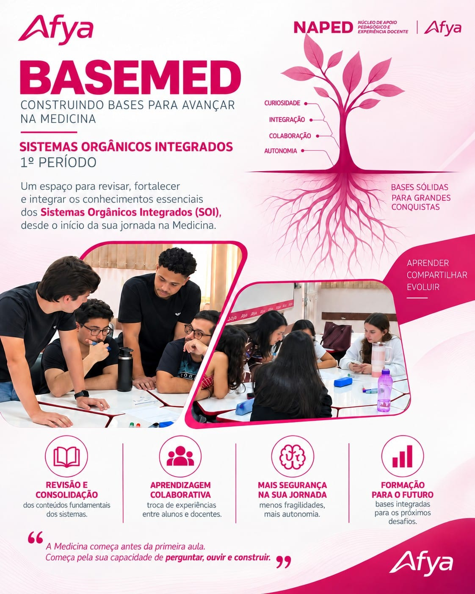

::: {.project-feature-image}
{fig-alt="Arte institucional do BASEMED com estudantes em pequenos grupos, a proposta de fortalecer os Sistemas Orgânicos Integrados e os pilares de revisão, aprendizagem colaborativa, segurança e formação"}
:::

O **BASEMED** é um projeto desenvolvido pela **Coordenação Acadêmica em parceria com o NAPED** para promover escuta, nivelamento e integração dos estudantes ingressantes do curso de Medicina. A iniciativa acolhe os alunos desde o início de sua trajetória acadêmica, fortalecendo bases essenciais para a adaptação às metodologias ativas e à dinâmica da matriz curricular.

Com atenção especial aos **Sistemas Orgânicos Integrados (SOI)** — eixo que costuma representar um desafio inicial para os ingressantes — o projeto propõe encontros semanais em pequenos grupos, destinados aos estudantes matriculados no primeiro período. As atividades favorecem a revisão e a consolidação de conteúdos fundamentais, a troca de experiências entre alunos e docentes e o desenvolvimento progressivo da autonomia para aprender.

Ao reconhecer precocemente dúvidas e dificuldades próprias da transição para o ensino superior, o BASEMED contribui para reduzir fragilidades iniciais e ampliar a segurança dos estudantes em sua jornada. Assim, transforma acolhimento e acompanhamento pedagógico em bases sólidas para os próximos desafios da formação médica.

## Ações do Projeto BASEMED

Esta ramificação reúne as ações do portfólio vinculadas ao Projeto BASEMED.


