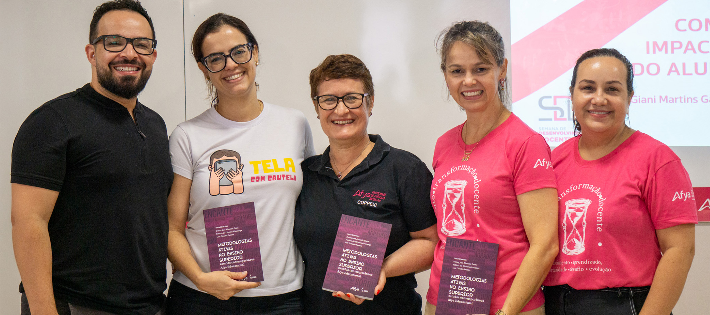

::: {.project-feature-image}
{fig-alt="Cinco integrantes da equipe da Afya Ipatinga reunidos; três deles seguram exemplares do livro Metodologias Ativas no Ensino Superior"}
:::

A nossa IES está presente no livro *METODOLOGIAS ATIVAS NO ENSINO SUPERIOR: ESTUDOS CONTEMPORÂNEOS AFYA EDUCACIONAL*. A publicação resulta de um esforço coletivo do NAPED, em parceria com os docentes, e reúne práticas pedagógicas de sucesso desenvolvidas em nossas instituições. Além disso, registra de forma científica a nossa filosofia pedagógica voltada para os processos de ensino-aprendizagem na graduação.

Destacamos a participação de nossos docentes no *CAPÍTULO 12* – "Construção e uso de estruturas 3D de proteínas como estratégia de um ensino criativo de bioquímica no curso de Medicina", de autoria de Analina Furtado Valadão, Jaqueline Melo Soares, Ana Carolina Vale Campos Lisbôa, com início na página 188.
