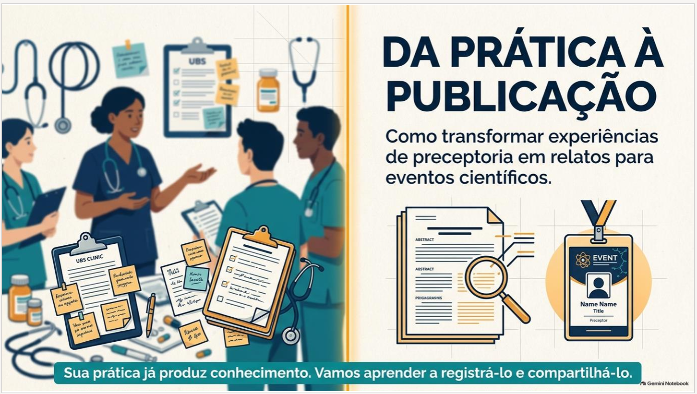
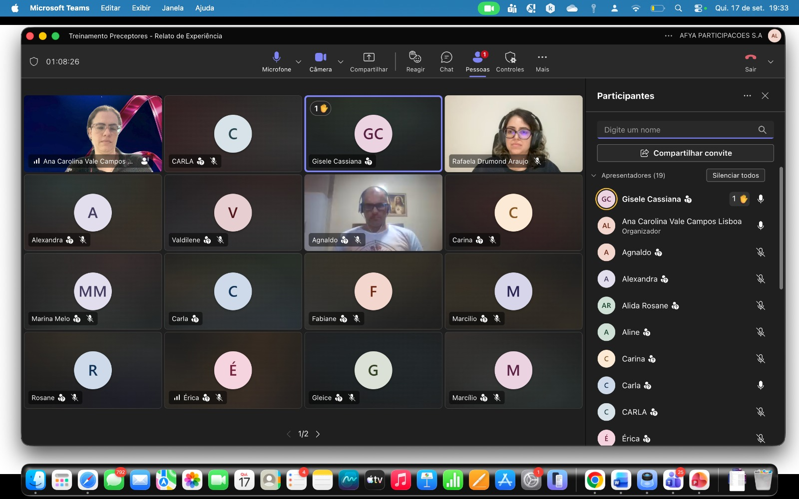
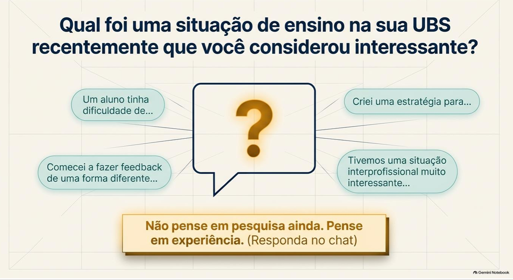
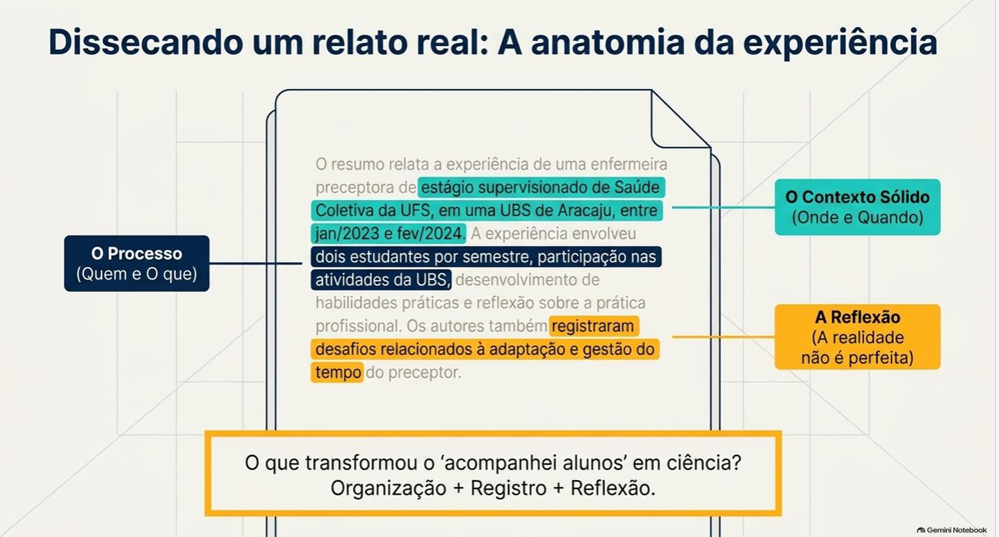
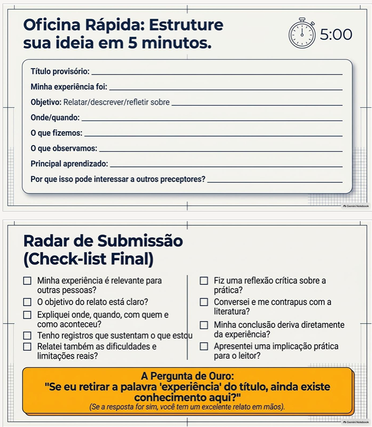

::: {.project-feature-image}
{fig-alt="Arte com profissionais de saúde e o título Da prática à publicação: como transformar experiências de preceptoria em relatos para eventos científicos"}
:::

Em 17 de setembro de 2026, o NAPED realizou o treinamento **Da prática à publicação**, destinado aos preceptores. A formação foi concebida para fortalecer a produção e a circulação de conhecimento a partir dos cenários reais de ensino e aprendizagem nas Unidades Básicas de Saúde (UBS).

O encontro partiu da compreensão de que a publicação científica não se limita a pesquisas de grande porte. Situações cotidianas de preceptoria — como o acompanhamento de estudantes, a construção de estratégias de ensino, o feedback, a integração interprofissional e os desafios enfrentados no serviço — podem constituir relatos de experiência relevantes quando são organizadas, registradas e analisadas de maneira crítica.

Ao longo da atividade, os participantes foram convidados a reconhecer situações significativas de suas próprias práticas e a estruturá-las considerando contexto, objetivo, percurso realizado, observações, aprendizados, limites e implicações para outros preceptores. A proposta buscou desmistificar a escrita científica, valorizar o conhecimento produzido no cotidiano das UBS e incentivar o compartilhamento de experiências que contribuam para qualificar a formação em saúde.

## Evidências do treinamento

{fig-alt="Tela de encontro on-line do treinamento com participantes e lista de presentes"}

{fig-alt="Slide que convida os participantes a identificarem uma situação de ensino interessante vivida na UBS"}

{fig-alt="Slide que apresenta contexto, processo e reflexão como componentes de um relato de experiência"}

{fig-alt="Slide com roteiro de oficina rápida e lista de verificação para estruturar um relato de experiência"}
